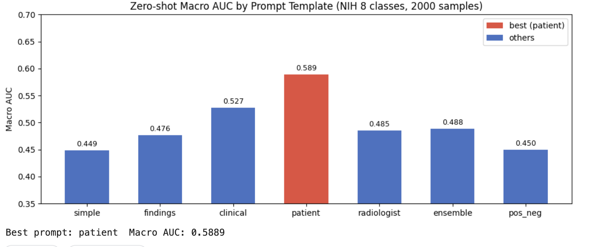
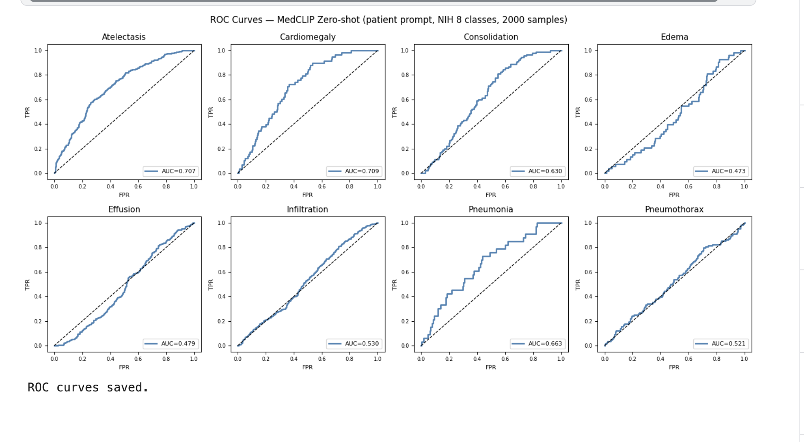

# Medical CLIP: Chest X-ray Retrieval and Zero-shot Diagnosis

A medical vision-language model trained on radiology report pairs via contrastive learning. Supports image-text retrieval and zero-shot disease classification on 8 pathology classes — no labeled training data required at inference time.

---

## Results

### Retrieval (OpenI test split, 320 samples)

| Direction | R@1 | R@5 | R@10 | MedR |
|-----------|-----|-----|------|------|
| Image → Text (MedCLIP) | **3.44%** | **12.19%** | **18.75%** | **54** |
| Image → Text (vanilla CLIP) | 0.31% | 0.94% | 2.81% | 162 |
| Text → Image (MedCLIP) | **3.75%** | **11.88%** | **18.44%** | **52.5** |
| Text → Image (vanilla CLIP) | 0.31% | 1.56% | 2.81% | 163 |

Fine-tuning on radiology report pairs improves Recall@1 by ~11x and cuts median rank from 162 → 54 over the vanilla CLIP baseline.

### Context vs published methods

| Model | Training pairs | Zero-shot Macro AUC (NIH) |
|-------|---------------|--------------------------|
| Vanilla CLIP | 400M (general) | ~0.50 |
| **Ours (patient prompt)** | **2,554** | **0.589** |
| MedCLIP — Wang et al., 2022 | ~200K | ~0.730 |
| CheXzero — Tiu et al., 2022 | ~227K | ~0.875 |

Our model uses 90× fewer training pairs than CheXzero and achieves 67% of its AUC — the gap is explained by data scale, not architecture.

### Zero-shot Classification (NIH ChestX-ray14, 2000 samples)

AUC-ROC by prompt template across 8 disease classes:

| Prompt | Atelectasis | Cardiomegaly | Consolidation | Edema | Effusion | Infiltration | Pneumonia | Pneumothorax | **Macro AUC** |
|--------|-------------|--------------|---------------|-------|----------|--------------|-----------|--------------|---------------|
| simple | 0.690 | 0.737 | 0.367 | 0.238 | 0.326 | 0.399 | 0.466 | 0.366 | 0.449 |
| findings | 0.703 | 0.730 | 0.477 | 0.264 | 0.353 | 0.370 | 0.504 | 0.409 | 0.476 |
| clinical | 0.720 | 0.710 | 0.557 | 0.455 | 0.356 | 0.488 | 0.574 | 0.358 | 0.527 |
| **patient** | **0.707** | 0.710 | **0.630** | **0.473** | **0.479** | **0.530** | **0.663** | **0.521** | **0.589** |
| radiologist | 0.712 | 0.709 | 0.536 | 0.290 | 0.369 | 0.394 | 0.521 | 0.352 | 0.485 |
| ensemble | 0.712 | **0.721** | 0.511 | 0.309 | 0.348 | 0.411 | 0.537 | 0.356 | 0.488 |



**Key findings:**
- `"A patient with {disease}"` is the best template for 6/8 classes (Macro AUC 0.589)
- Consolidation shows the largest prompt sensitivity: 0.367 → 0.630 (+0.26 AUC)
- Atelectasis and Cardiomegaly are prompt-insensitive (range < 0.03)
- Ensemble averaging does **not** win — negative interference between prompt styles hurts more than diversity helps
- Edema is the hardest class (best AUC 0.473), likely due to underrepresentation in OpenI training reports



---

## Method

We fine-tune a CLIP-style model on (X-ray image, radiology report) pairs using InfoNCE contrastive loss. The image encoder starts from OpenAI's pretrained ViT-B/32; the text encoder uses ClinicalBERT, pretrained on clinical notes.

```
X-ray image      →  ViT-B/32  →  Linear(512→512)  ─┐
                                                      ├─ cosine sim → InfoNCE loss (τ=0.07)
Radiology report →  ClinicalBERT  →  Linear(768→512) ─┘
```

At inference, zero-shot classification works by comparing image embeddings against text prompt embeddings — no task-specific labels needed.

**Design choices:**
- Freeze the first 8 ViT transformer blocks; fine-tune the rest + projection heads
- Use `Findings + Impression` sections of radiology reports as the paired text caption
- Patient-level train/val/test split to prevent data leakage

**Training:** Best checkpoint at Epoch 9 (val_loss = 3.640); overfitting begins thereafter, reflecting the small dataset size (2,554 training pairs).

---

## Datasets

| Dataset | Role | Size | Source |
|---------|------|------|--------|
| Indiana University OpenI | Training (image + report pairs) | 7,470 images, 3,955 reports | [Kaggle](https://www.kaggle.com/datasets/raddar/chest-xrays-indiana-university) |
| NIH ChestX-ray14 | Zero-shot evaluation only | 112,120 images, 14 disease labels | [Kaggle](https://www.kaggle.com/datasets/nih-chest-xrays/data) |

### Download

```bash
# Requires Kaggle API credentials (~/.kaggle/kaggle.json)
kaggle datasets download raddar/chest-xrays-indiana-university -p data/indiana --unzip
kaggle datasets download nih-chest-xrays/data -p data/nih --unzip
```

**Zero-shot disease classes (NIH):** Atelectasis · Cardiomegaly · Consolidation · Edema · Effusion · Infiltration · Pneumonia · Pneumothorax

---

## Project Structure

```
xray/
├── data/
│   ├── indiana/          # OpenI images + XML reports
│   └── nih/              # NIH images + Data_Entry_2017.csv
├── src/
│   ├── dataset.py        # OpenIDataset, NIHDataset
│   ├── model.py          # MedCLIP model class
│   ├── loss.py           # InfoNCE loss
│   ├── train.py          # training loop
│   ├── retrieval.py      # Recall@K, MedR evaluation
│   ├── zeroshot.py       # zero-shot classifier
│   └── prompts.py        # prompt template library
├── notebooks/
│   └── 03_evaluation.ipynb   # retrieval + zero-shot evaluation
├── configs/
│   └── base.yaml         # hyperparameters
├── checkpoints/
│   └── best.pt           # best model (Epoch 9)
├── results.md
└── requirements.txt
```

---

## Setup

```bash
git clone https://github.com/maxzhang646/medical-clip.git
cd medical-clip
pip install -r requirements.txt
```

Requirements: Python 3.10+, PyTorch 2.0+ (MPS supported for Apple Silicon).

---

## Training

```bash
python src/train.py --config configs/base.yaml
```

The training script auto-detects MPS (Apple Silicon) / CUDA / CPU.

---

## Evaluation

```bash
# Retrieval on OpenI test split
python src/retrieval.py --checkpoint checkpoints/best.pt

# Zero-shot classification on NIH
python src/zeroshot.py --checkpoint checkpoints/best.pt --prompt patient
```

---

## References

- [OpenAI CLIP](https://arxiv.org/abs/2103.00020) — Radford et al., 2021
- [ConVIRT](https://arxiv.org/abs/2010.00747) — Zhang et al., 2020
- [CheXzero](https://www.nature.com/articles/s41551-022-00936-9) — Tiu et al., 2022
- [MedCLIP](https://arxiv.org/abs/2210.10163) — Wang et al., 2022
- [ClinicalBERT](https://arxiv.org/abs/1904.05342) — Alsentzer et al., 2019
