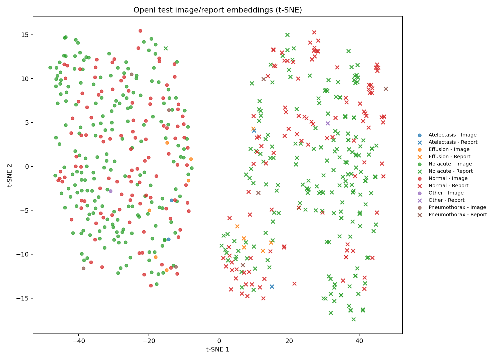

# Experimental Results

## 1. Retrieval (OpenI test split, 320 samples)

| Direction | Metric | MedCLIP | Vanilla CLIP | Improvement |
|-----------|--------|---------|--------------|-------------|
| I→T | R@1 | 3.44 | 0.00 | above zero baseline |
| I→T | R@5 | 12.19 | 1.56 | 8x |
| I→T | R@10 | 18.75 | 3.12 | 6x |
| I→T | MedR | 54.00 | 162.50 | 3x better |
| T→I | R@1 | 3.75 | 0.31 | 12x |
| T→I | R@5 | 11.88 | 2.81 | 4x |
| T→I | R@10 | 18.44 | 4.06 | 5x |
| T→I | MedR | 52.50 | 166.00 | 3x better |

Vanilla CLIP baseline was rerun with `scripts/stage3_vanilla_clip_baseline.py`, using the original OpenAI CLIP image and text towers with CLIP preprocessing/tokenization. Fine-tuned MedCLIP was rerun with `scripts/stage3_medclip_diagnostic.py`.

| Model | Matched mean | Random mean | Matched - Random |
|-------|--------------|-------------|------------------|
| Vanilla OpenAI CLIP | 0.3043 | 0.3039 | 0.0005 |
| Fine-tuned MedCLIP | 0.3037 | 0.1510 | 0.1526 |

This shows that general-domain CLIP alignment does not meaningfully separate exact OpenI image/report pairs. Fine-tuning does learn domain-specific alignment: matched pairs remain high while random mismatches are pushed lower. The remaining weakness is ranking strength, not the complete absence of alignment.

### Preprocessing ablation and retraining

The project now supports `data.image_normalization: imagenet | clip`. An inference-only ablation with the same `checkpoints/best.pt` gives:

| Normalization | I→T R@1 | I→T R@5 | I→T R@10 | I→T MedR | T→I R@1 | T→I R@5 | T→I R@10 | T→I MedR | Gap |
|---------------|---------|---------|----------|----------|---------|---------|----------|----------|-----|
| ImageNet | 3.44 | 12.19 | 18.75 | 54.00 | 3.75 | 11.88 | 18.44 | 52.50 | 0.1526 |
| CLIP | 2.81 | 12.81 | 18.75 | 53.50 | 3.44 | 10.94 | 18.75 | 49.50 | 0.1525 |

This does not show a clear inference-time win for CLIP normalization. Because the checkpoint was trained with ImageNet normalization, the stronger test would be a short retraining run with `image_normalization: clip`.

That retraining run is now recorded in `stage3_clipnorm_training_summary.md`. It used `configs/clipnorm.yaml`, trained for 15 epochs, and saved the best epoch-10 checkpoint to `checkpoints_clipnorm/best.pt`.

| Model | I→T R@1 | I→T R@5 | I→T R@10 | I→T MedR | T→I R@1 | T→I R@5 | T→I R@10 | T→I MedR | Gap |
|-------|---------|---------|----------|----------|---------|---------|----------|----------|-----|
| Original ImageNet-norm checkpoint | 3.44 | 12.19 | 18.75 | 54.00 | 3.75 | 11.88 | 18.44 | 52.50 | 0.1526 |
| Retrained CLIP-norm checkpoint | 3.75 | 12.81 | 20.62 | 49.50 | 4.38 | 11.88 | 19.38 | 47.00 | 0.1717 |

CLIP-normalization retraining gives a moderate but real improvement in R@10, median rank, and matched-vs-random separation. It does not dramatically change R@5, so the next bottleneck is likely not just preprocessing.

### Medical pretrained baseline: BioMedCLIP

BioMedCLIP was evaluated with `scripts/stage3_biomedclip_baseline.py` using `hf-hub:microsoft/BiomedCLIP-PubMedBERT_256-vit_base_patch16_224`.

| Model | I→T R@1 | I→T R@5 | I→T R@10 | I→T MedR | T→I R@1 | T→I R@5 | T→I R@10 | T→I MedR | Gap |
|-------|---------|---------|----------|----------|---------|---------|----------|----------|-----|
| Vanilla OpenAI CLIP | 0.00 | 1.56 | 3.12 | 162.50 | 0.31 | 2.81 | 4.06 | 166.00 | 0.0005 |
| BioMedCLIP | 1.56 | 5.31 | 8.12 | 120.00 | 1.25 | 6.25 | 8.75 | 108.50 | 0.0154 |
| Retrained CLIP-norm MedCLIP | 3.75 | 12.81 | 20.62 | 49.50 | 4.38 | 11.88 | 19.38 | 47.00 | 0.1717 |

BioMedCLIP is stronger than vanilla OpenAI CLIP on exact OpenI retrieval, but weaker than the project-specific fine-tuned checkpoint.

That comparison is not fair, though: only our checkpoint had been trained on OpenI. It confounds the
initialization with the fact that one side got a fine-tuning budget and the other did not. Stage 4
removes the confound.

### Stage 4: BioMedCLIP fine-tuned on OpenI

BioMedCLIP was fine-tuned on the same 2,554 training pairs with everything except `lr_encoders` held
identical to `configs/clipnorm.yaml` (batch 64, 15 epochs, freeze 8 image blocks, cosine + warmup,
same splits). Three LR arms were run on a Kaggle T4 (~81 min each).

| Model | I→T R@1 | R@5 | R@10 | MedR | T→I R@1 | R@5 | R@10 | MedR | Gap |
|-------|---------|-----|------|------|---------|-----|------|------|-----|
| Vanilla OpenAI CLIP (zero-shot) | 0.00 | 1.56 | 3.12 | 162.50 | 0.31 | 2.81 | 4.06 | 166.00 | 0.0005 |
| BioMedCLIP (zero-shot) | 1.56 | 5.31 | 8.12 | 120.00 | 1.25 | 6.25 | 8.75 | 108.50 | 0.0154 |
| CLIP+ClinicalBERT (CLIP-norm, FT) | 3.75 | 12.81 | 20.62 | 49.50 | 4.38 | 11.88 | 19.38 | 47.00 | 0.1717 |
| **BioMedCLIP FT (lr 1e-5)** | **6.25** | **17.50** | **27.19** | **45.50** | **5.31** | **17.50** | **23.75** | 46.00 | 0.0230 |
| BioMedCLIP FT (lr 3e-6) | 5.00 | 17.19 | 25.62 | 46.50 | 4.06 | 14.69 | 23.12 | 47.50 | 0.0232 |
| BioMedCLIP FT (lr 1e-6) | 3.12 | 12.50 | 20.00 | 67.00 | 2.50 | 13.44 | 18.12 | 58.50 | 0.0146 |

The LR sweep exists so that a bad result could be attributed to the learning rate rather than to the
backbone. It was not needed in that direction: the largest LR won, and the anticipated catastrophic
forgetting did not appear — `lr1e5` improved for three epochs (val_loss 4.53 → 3.6278) before
overfitting. The smallest LR clearly underfits.

Stage 5 added a fourth run: the same lr 1e-5 with the epoch budget cut from 15 to 5 (26 min instead
of 81).

| Run | I→T R@1 | R@5 | R@10 | MedR | T→I R@5 | Best val_loss | Best epoch |
|-----|---------|-----|------|------|---------|---------------|------------|
| lr 1e-5, 15 epochs | 6.25 | 17.50 | 27.19 | 45.50 | 17.50 | 3.6278 | 3 |
| lr 1e-5, 5 epochs | 5.94 | 16.56 | 26.25 | **45.00** | 15.62 | 3.6504 | 3 |

**How large is a real difference here?** With 320 test queries, the standard error on R@5 near 17% is
`sqrt(0.17 x 0.83 / 320)` ≈ 2.1 percentage points. Every gap in the table above is inside one standard
error, as is lr1e5 vs lr3e6 (17.50 vs 17.19). So the ranking *within* the fine-tuned BioMedCLIP runs
is not statistically meaningful: learning rate between 1e-5 and 3e-6, and epoch budget between 5 and
15, are all equivalent at this sample size. What does clear the bar:

- lr 1e-6 underfits (12.50, ~2 SE below the others)
- 15 epochs ends above the random baseline in val_loss while 5 epochs stays flat — the shorter budget
  is not better, it is *safer*
- BioMedCLIP FT over CLIP+ClinicalBERT FT (17.50 vs 12.81) is ~2.2 SE, on a paired test set, so this
  one holds

Peak at epoch 3 under both a 15-epoch and a 5-epoch cosine schedule points at the data rather than the
schedule: roughly three passes exhaust what 2,554 pairs can teach an already-aligned model.

Training dynamics differ sharply from the CLIP+ClinicalBERT model:

| Model | Best val_loss | Best epoch |
|-------|---------------|------------|
| CLIP+ClinicalBERT | 3.6404 | 9 |
| BioMedCLIP (lr 1e-5) | 3.6278 | 3 |

An already-aligned model exhausts what 2,554 pairs can teach it in a third of the epochs; by epoch 15
val_loss reaches 4.2297, above the ln(64) = 4.159 random baseline.

### Completing the 2x2 (I→T R@5)

|  | zero-shot | fine-tuned on OpenI |
|--|-----------|---------------------|
| CLIP + ClinicalBERT | 1.56 | 12.81 |
| **BioMedCLIP** | **5.31** | **17.50** |

Both main effects are positive and do not interact destructively: fine-tuning helps in both rows,
medical-domain pretraining helps in both columns, and the combination is best. Against the previous
best checkpoint, BioMedCLIP FT improves I→T R@1 by 67%, R@5 by 37%, R@10 by 32%, and T→I R@5 by 47%.

**Revised conclusion.** Stage 3 concluded that task-specific fine-tuning mattered more than
medical-domain pretraining. That conclusion was an artifact of the unfair comparison. Given an equal
fine-tuning budget on identical data, the medical-pretrained starting point wins on every ranking
metric: the initialization matters more than the fine-tuning recipe.

### The raw gap is not comparable across backbones

BioMedCLIP FT retrieves better than the CLIP+ClinicalBERT checkpoint while showing a gap 7x smaller
(0.0230 vs 0.1717). The metrics do not actually disagree — the raw gap is not scale-free:

BioMedCLIP's embeddings occupy a narrow cone: two unrelated image/report vectors already sit at 0.394
cosine similarity. Absolute differences are therefore compressed while the *ranking* is unaffected.

Two repairs were tried, and both fail. Measured on the same test split (BioMedCLIP row is the lr3e6
checkpoint, evaluated locally):

| Model | gap | gap / random std | per-query z (I→T) | I→T R@5 |
|-------|-----|------------------|-------------------|---------|
| CLIP+ClinicalBERT FT | 0.1717 | 1.0965 | 1.0740 | 12.81 |
| BioMedCLIP FT | 0.0238 | 0.9379 | 1.0332 | **17.50** |

Normalizing by the spread of the random scores makes the statistic scale-free, and the per-query
z-score (how far the true match sits above *that query's own* distractors, in units of that query's
own spread) removes the global-average assumption. **Both still rank BioMedCLIP below
CLIP+ClinicalBERT, the opposite of the retrieval order.**

The reason is that all three summarize central tendency, while ranking is a tail property: R@K is
decided by *how many* distractors beat the true match, not by where the average distractor sits. With
many near-identical "no acute cardiopulmonary disease" reports, a model can have a good mean margin
and still lose to a handful of confusable neighbours.

So the matched-vs-random family answers only the narrow question it was introduced for — *is there
any alignment at all* (vanilla CLIP: 0.0005 → no) — and within one backbone, where it correctly
separated the preprocessing ablations. For *which model aligns better*, MedR and R@K are the summary
statistics, and they are rank-based by construction.
`scripts/stage3_medclip_diagnostic.py` reports all three so the discrepancy stays visible.

### Remaining confounds

Not everything is controlled, and the win should not be read as purely "medical pretraining":

- **Image backbone**: BioMedCLIP is ViT-B/16, ours is ViT-B/32. Part of the gain comes from the finer
  patch size. This cannot be separated without a B/16 version of the general-domain model.
- **Text context length**: 256 (BioMedCLIP) vs 128 tokens. Minor — a typical OpenI caption is ~53
  tokens, so few captions were truncated either way.
- **Temperature**: BioMedCLIP keeps its pretrained `logit_scale` (~0.0117) instead of the configured
  0.07. Replacing it would have destroyed the pretrained alignment, so it was deliberately kept.

### Qualitative retrieval examples

Stage 3 adds qualitative retrieval outputs to inspect what the embedding space retrieves, not just whether the exact paired report/image is ranked highly.

| Direction | Output file | Recall@5 in qualitative run | Cases |
|-----------|-------------|-----------------------------|-------|
| Image → Text | `stage3_retrieval_examples.md` | 12.50% | 8 mixed cases |
| Text → Image | `stage3_text_to_image_examples.md` | 11.87% | 8 mixed cases |

The qualitative files intentionally include both top-5 hits and misses. This makes it easier to see whether failed exact-match retrievals are still medically close, or whether they are driven by generic report boilerplate such as "no acute cardiopulmonary disease."

Early qualitative pattern:
- Exact paired report/image is often not rank 1.
- Some misses are still clinically or linguistically close.
- Normal chest X-ray reports can be hard to distinguish because many share near-identical wording.
- Retrieval quality should be interpreted as both exact-match ranking and medical semantic similarity.

### Embedding visualization

Stage 3 also includes a t-SNE visualization of the OpenI test image/report embeddings:

The visualization shows image embeddings and report embeddings in the same projected space. The two modalities still form visibly different regions, which suggests the learned shared space is only partially aligned. This is consistent with the modest retrieval metrics and reinforces that the current model is a learning prototype rather than a strong medical retriever.

## 2. Zero-shot Classification (NIH ChestX-ray14, 2000 samples)

### Comparison with published methods

| Model | Training pairs | Macro AUC (NIH) | Notes |
|-------|---------------|-----------------|-------|
| Vanilla CLIP (baseline) | 400M (general) | ~0.50 | No medical fine-tuning |
| Ours, CLIP+ClinicalBERT (patient prompt) | 2,554 | 0.589 | OpenI only |
| **Ours, BioMedCLIP FT (clinical prompt)** | **2,554** | **0.682** | OpenI only |
| MedCLIP — Wang et al., 2022 | ~200K | ~0.730 | Mixed medical datasets |
| CheXzero — Tiu et al., 2022 | ~227K | ~0.875 | MIMIC-CXR reports |

Direct comparison is approximate — published methods use different test set sizes and class subsets. The gap narrows substantially when normalized by training data: with **89× fewer pairs** than CheXzero we reach 78% of its AUC, and we are now within 0.05 of MedCLIP, which used ~78× more pairs.

### Per-disease AUC by prompt template

| Prompt | Atelectasis | Cardiomegaly | Consolidation | Edema | Effusion | Infiltration | Pneumonia | Pneumothorax | Macro AUC |
|--------|-------------|--------------|---------------|-------|----------|--------------|-----------|--------------|-----------|
| simple | 0.6900 | 0.7373 | 0.3672 | 0.2382 | 0.3262 | 0.3985 | 0.4662 | 0.3661 | 0.4487 |
| findings | 0.7027 | 0.7300 | 0.4772 | 0.2636 | 0.3531 | 0.3701 | 0.5042 | 0.4090 | 0.4762 |
| clinical | 0.7203 | 0.7103 | 0.5570 | 0.4548 | 0.3564 | 0.4879 | 0.5743 | 0.3578 | 0.5273 |
| **patient** | **0.7069** | 0.7095 | **0.6297** | **0.4729** | **0.4785** | **0.5299** | **0.6626** | **0.5210** | **0.5889** |
| radiologist | 0.7116 | 0.7088 | 0.5363 | 0.2904 | 0.3689 | 0.3939 | 0.5211 | 0.3518 | 0.4854 |
| ensemble | 0.7121 | **0.7214** | 0.5111 | 0.3087 | 0.3482 | 0.4114 | 0.5368 | 0.3563 | 0.4882 |
| pos_neg | 0.7082 | 0.7240 | 0.4035 | 0.2388 | 0.2994 | 0.3816 | 0.4956 | 0.3457 | 0.4496 |

### Key findings

- `patient` ("A patient with {disease}") is best for 6/8 diseases; Macro AUC 0.589
- Atelectasis and Cardiomegaly are prompt-insensitive (range < 0.03 across all prompts)
- Consolidation shows largest prompt sensitivity: 0.367 → 0.630 (+0.26 AUC)
- Edema is hardest: best AUC 0.473, below random for most prompts
- Ensemble does NOT win — averaging diverse styles causes negative interference
- `pos_neg` (positive + negative templates averaged) is the worst strategy: Macro AUC 0.4496, barely above `simple` (0.4487). Averaging in "No evidence of X" pulls the class embedding toward no-disease space, hurting recall across the board — Effusion drops to 0.299 (worst of any prompt/class combination)

### Stage 5: the same prompt ablation on the BioMedCLIP backbone

The fine-tuned BioMedCLIP checkpoint (lr 1e-5, 5 epochs) was evaluated on the *same* seed-42
2,000-image subset, so the numbers are directly comparable.

| Prompt | Atelectasis | Cardiomegaly | Consolidation | Edema | Effusion | Infiltration | Pneumonia | Pneumothorax | Macro AUC | vs CLIP+ClinicalBERT |
|--------|-------------|--------------|---------------|-------|----------|--------------|-----------|--------------|-----------|----------------------|
| simple | 0.5729 | 0.7788 | 0.6826 | 0.4682 | 0.7780 | 0.3737 | 0.6744 | 0.5935 | 0.6153 | +0.167 |
| findings | 0.6675 | 0.7769 | 0.6914 | 0.7537 | 0.7473 | 0.4788 | 0.6636 | 0.5961 | 0.6719 | +0.196 |
| **clinical** | 0.6358 | 0.7714 | 0.6423 | **0.7882** | 0.7695 | 0.4630 | 0.7076 | 0.6813 | **0.6824** | +0.155 |
| patient | 0.6934 | 0.7866 | 0.6529 | 0.6249 | 0.7636 | 0.4152 | 0.6894 | 0.6876 | 0.6642 | +0.075 |
| radiologist | 0.6906 | 0.7876 | 0.6680 | 0.6027 | 0.7818 | 0.3995 | 0.6430 | 0.6600 | 0.6542 | +0.169 |
| ensemble | 0.6721 | 0.7822 | 0.6897 | 0.6862 | 0.7742 | 0.4043 | 0.7026 | 0.6494 | 0.6701 | +0.182 |
| pos_neg | 0.6410 | 0.7716 | 0.5189 | 0.4664 | 0.7251 | 0.3778 | 0.6339 | 0.5960 | 0.5913 | +0.142 |

All seven templates improve, and the best Macro AUC goes 0.589 -> 0.682. More importantly, the
backbone change acts as an independent test of the three claims made from the first ablation:

| Claim from the CLIP+ClinicalBERT ablation | Survives the backbone change? |
|-------------------------------------------|-------------------------------|
| `patient` is the best template | **No.** Best is now `clinical` (0.6824); `patient` drops to 4th (0.6642). |
| `ensemble` loses to the best single prompt through negative interference | **No.** `ensemble` is now 3rd of 7, above `patient` and `radiologist`. |
| `pos_neg` is the worst strategy | **Yes.** Last on both backbones (0.4496, 0.5913). |

So two of the three were properties of one checkpoint, not of prompt design. Only the negative
result generalizes: averaging "No evidence of {disease}" into the class embedding pulls it toward
no-disease space, and that hurts regardless of backbone.

A fourth observation is new: **prompt sensitivity shrinks as the representation improves.** The
spread across templates falls from 0.140 (CLIP+ClinicalBERT) to 0.091 (BioMedCLIP). Prompt
engineering matters most when the visual representation is weak.

**Statistical caveat.** With 2,000 images, per-class AUCs for rare findings have wide error bars --
roughly +/-0.06 for Edema (~40 positives) and +/-0.09 for Pneumonia (~26). Single-class differences
below ~0.1 should not be read as real. The Macro AUC gains (+0.075 to +0.196 across all seven
templates) and the Infiltration result (~340 positives, SE ~0.027) are well outside that range.

## 3. Edema Failure Analysis

Edema is the only class with best AUC below 0.5 (0.473), effectively random. Three compounding causes:

**Training data scarcity.** OpenI has ~3,955 reports total. Pulmonary edema is a secondary presentation of heart failure and appears infrequently in a general chest X-ray dataset — estimated <8% prevalence, yielding ~200 training pairs. The model never sees enough Edema examples to learn a stable visual-language alignment.

**Visual overlap with adjacent classes.** Edema's radiographic features (bilateral haziness, perihilar butterfly pattern, blunted costophrenic angles) overlap substantially with Effusion (fluid at lung bases) and Consolidation (airspace opacity). The model likely attributes Edema's visual signal to these more frequent neighbors during contrastive training.

**NIH label noise.** NIH labels are NLP-extracted from radiology reports. Radiologists describe pulmonary edema using varied terminology ("pulmonary congestion", "vascular engorgement", "interstitial edema") that NLP tools miss, producing noisier ground truth for Edema than for well-defined classes like Cardiomegaly.

**Prompt engineering cannot fix this.** Even the best prompt (`patient`) only reaches AUC 0.473 — the ceiling is set by the quality of the learned visual representation, not the inference-time text. Fixing Edema would require more training data (e.g. MIMIC-CXR) or explicit oversampling of Edema-positive reports.

> **Corrected by Stage 5.** The diagnosis above was right and the prescription was too narrow.
> The ceiling *was* the visual representation — but a better pretrained backbone lifted it without
> any new data. On the same 2,554 OpenI pairs, fine-tuned BioMedCLIP reaches **Edema AUC 0.7882**
> (`clinical` prompt) versus 0.4729 here, and Effusion goes 0.4785 -> 0.7818. MIMIC-CXR was not
> needed. This also downgrades the first two causes listed above: training-data scarcity and visual
> overlap with neighbouring classes cannot be the binding constraints, since the same data and the
> same overlapping classes now yield a strong Edema AUC. What was actually missing was a chest-X-ray
> representation good enough to encode the finding at all.
>
> Infiltration replaces Edema as the one systematically broken class: 0.374–0.479 across all seven
> templates, below random everywhere, and with ~340 positives the error bars are too tight for that
> to be noise.

## 4. Training

- Best checkpoint: Epoch 9, val_loss = 3.6404
- Overfitting onset: ~Epoch 9 (train/val gap widens)
- Dataset size limitation (2554 train samples) is primary bottleneck
